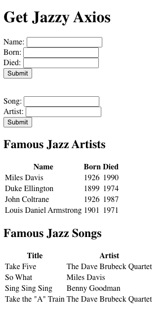

# Get Jazzy AJAX

## Description

In this project, we learned how to use axios to GET objects from two arrays of Jazz Artists and Jazz Songs and display them in tables. Above the tables are two forms that the user can input information to be added to the arrays and then displayed in the respective table. 

The first form is for Artists and allows the user to input the artist's `Name`, the year the artist was `Born`, and the year the artist `Died`. 
The second form is for Songs and allows the user to input the `Song` name and the `Artist`. Once either submit button is clicked, the information is added to the array of objects and then displayed in the table below.

## Screenshot

## Technologies

* Node.js
* Express

## Installation

1. `npm install` 
2. Navigate to `http://localhost:5001/`

